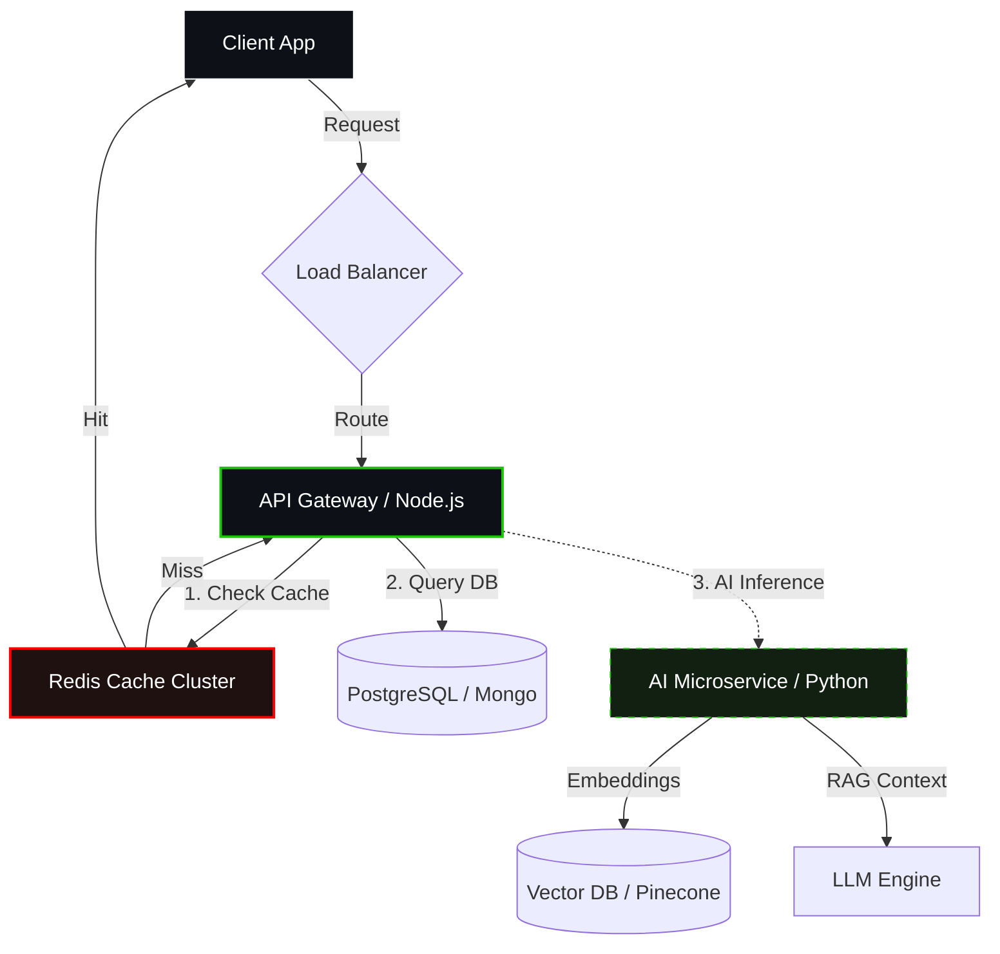
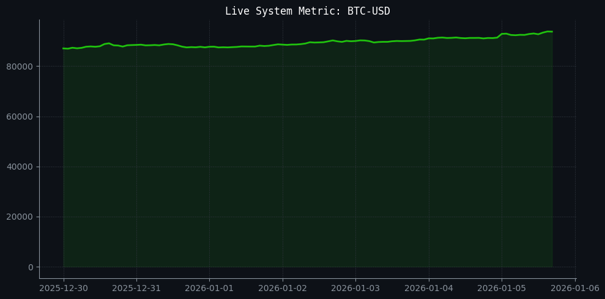

  

  
  
  

 

### ⚡ Engineered for Scale & Intelligence
* **Core Competency:** Building high-throughput backend systems integrated with Generative AI models.
* **Current Focus:** Optimization of Vector Database retrieval speeds & Redis Pub/Sub architectures.
* **Philosophy:** *"If it's not automated, it's not finished."*

---

### 🏗️ My Hybrid System Architecture

### 📊 Engineering Telemetry

| **Automated Data Pipeline** | **Coding Velocity** |
| --- | --- |
|  |  |
| *Live Python Cron Job (Updates every 6hr)* | *GitHub Contributions Metrics* |

### 🛠 Technical Arsenal

<table>
<tr>
<td align="center" width="120"><b>Backend</b></td>
<td></td>
</tr>
<tr>
<td align="center" width="120"><b>Data & Cache</b></td>
<td></td>
</tr>
<tr>
<td align="center" width="120"><b>AI & ML</b></td>
<td></td>
</tr>
<tr>
<td align="center" width="120"><b>DevOps</b></td>
<td></td>
</tr>
</table>

### 🐍 Contribution Activity

