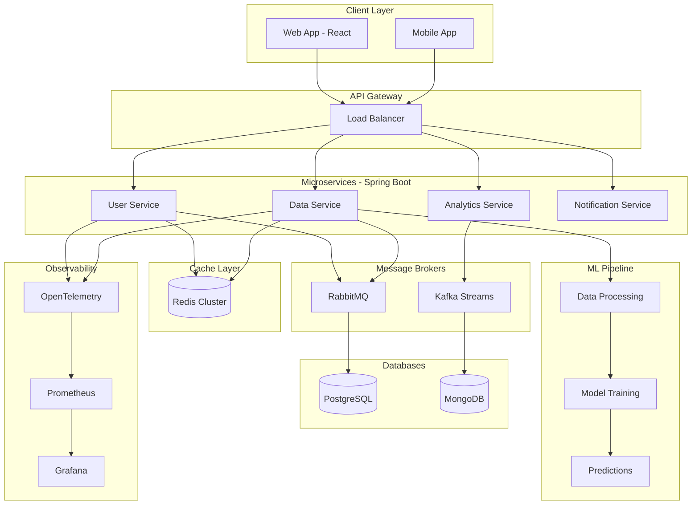

<div align="center">

# ⚡ BHUVAN G S ⚡

```ascii
╔═══════════════════════════════════════════════════════════════════════════╗
║                                                                           ║
║   ██████╗ ██╗   ██╗██╗██╗     ██████╗ ██╗███╗   ██╗ ██████╗              ║
║   ██╔══██╗██║   ██║██║██║     ██╔══██╗██║████╗  ██║██╔════╝              ║
║   ██████╔╝██║   ██║██║██║     ██║  ██║██║██╔██╗ ██║██║  ███╗             ║
║   ██╔══██╗██║   ██║██║██║     ██║  ██║██║██║╚██╗██║██║   ██║             ║
║   ██████╔╝╚██████╔╝██║███████╗██████╔╝██║██║ ╚████║╚██████╔╝             ║
║   ╚═════╝  ╚═════╝ ╚═╝╚══════╝╚═════╝ ╚═╝╚═╝  ╚═══╝ ╚═════╝              ║
║                                                                           ║
║           💎 Code the Future | Scale the Systems 💎                      ║
╚═══════════════════════════════════════════════════════════════════════════╝
```


</div>

---

<div align="center">

## 🔗 CONNECT WITH ME

[](https://linkedin.com/in/bhuvan-g-sangappanavar-403a022a2)
[](mailto:bhuvangs.personal@gmail.com)
[](https://leetcode.com/u/Hackky_Freddy/)
[](https://github.com/Bhuvangs04)


</div>

---

## 💼 FULL STACK SYSTEM ARCHITECT

<details open>
<summary><b>☕ JAVA - ENTERPRISE BACKEND</b></summary>

```java
public class SystemArchitect {
    private String name = "Bhuvan G S";
    private String role = "Full Stack Developer | Backend Specialist";
    
    // Core Technical Expertise
    public Map<String, Object> getTechnicalSkills() {
        return Map.of(
            "backend_architecture", List.of(
                "Microservices (Spring Boot)",
                "RESTful & gRPC APIs",
                "Event-Driven Architecture",
                "Reactive Programming (Spring WebFlux)"
            ),
            "message_systems", List.of(
                "RabbitMQ - Asynchronous Processing",
                "Apache Kafka - Event Streaming",
                "Redis Pub/Sub"
            ),
            "caching", List.of(
                "Redis (High-Performance Caching)",
                "Hazelcast",
                "Caffeine Cache"
            ),
            "databases", Map.of(
                "sql", List.of("PostgreSQL", "MySQL"),
                "nosql", List.of("MongoDB", "DynamoDB")
            )
        );
    }
    
    // Cloud Infrastructure
    public List<String> getCloudServices() {
        return List.of(
            "EC2 - Auto-scaling Instances",
            "Lambda - Serverless Functions",
            "ECS/EKS - Container Orchestration",
            "S3 - Object Storage",
            "RDS - Managed Databases",
            "ElastiCache - Redis Cluster"
        );
    }
}
```
</details>

<details open>
<summary><b>🐍 PYTHON - DATA & ML SYSTEMS</b></summary>

```python
class DataEngineer:
    """Building Data Pipelines & ML Systems"""
    
    def __init__(self):
        self.tech_stack = {
            "ml_ai": {
                "frameworks": ["TensorFlow", "PyTorch", "Scikit-learn"],
                "rag_systems": ["LangChain", "ChromaDB", "Pinecone"],
                "nlp": "Natural Language Processing"
            },
            "data_engineering": [
                "Apache Airflow - Workflow Orchestration",
                "Pandas/NumPy - Data Processing",
                "Kafka - Real-time Streaming"
            ],
            "observability": {
                "tracing": "OpenTelemetry",
                "monitoring": ["Prometheus", "Grafana", "Datadog"],
                "logging": "ELK Stack + CloudWatch"
            },
            "apis": [
                "FastAPI - High-performance APIs",
                "Django - Web Applications",
                "Flask - Lightweight Services"
            ]
        }
    
    def build_systems(self):
        return "Scalable, Observable, Efficient"
```
</details>

<details open>
<summary><b>⚡ JAVASCRIPT/NODE.JS - MODERN WEB</b></summary>

```javascript
class FullStackDeveloper {
    constructor() {
        this.stack = {
            backend: {
                runtime: "Node.js (High Concurrency)",
                frameworks: ["Express.js", "Fastify"],
                realtime: "Socket.io / WebSockets",
                queues: "Bull - Job Processing with Redis"
            },
            frontend: {
                framework: "React + Redux Toolkit",
                styling: "Tailwind CSS + Material-UI",
                state: "Context API / Redux",
                charts: "Recharts / Chart.js"
            },
            apis: {
                rest: "Express REST APIs",
                graphql: "Apollo Server",
                websockets: "Real-time Communication"
            }
        };
    }
    
    async buildModernApp() {
        const cache = await this.setupRedis();
        const queue = await this.setupRabbitMQ();
        return { cache, queue, status: "PRODUCTION READY 🚀" };
    }
}
```
</details>

<details open>
<summary><b>💎 C++ - PERFORMANCE CRITICAL</b></summary>

```cpp
class PerformanceOptimizer {
private:
    std::string focus = "System Performance";
    
public:
    struct OptimizationTools {
        std::vector<std::string> techniques = {
            "Memory Management",
            "Multi-threading",
            "Algorithm Optimization",
            "Low-level System Programming"
        };
    };
    
    // Used for performance-critical components
    void optimizeSystem() {
        // High-performance computing
    }
};
```
</details>

---

## 🎯 TECHNOLOGY STACK

<div align="center">

### 💻 Core Languages


### 🏗️ Backend Frameworks


### ⚡ Message Brokers & Streaming


### 💾 Caching & Performance


### ☁️ AWS Cloud Services


### 🗄️ Databases


### 🐳 DevOps & Containers


### 📊 Observability & Monitoring


### 🤖 AI/ML & RAG Systems


### 🎨 Frontend Technologies


</div>

---

## 📈 GITHUB ANALYTICS

<div align="center">


</div>

<div align="center">
  


</div>

---

## 💎 SKILLS BREAKDOWN

<div align="center">

```text
╔═══════════════════════════════════════════════════════════════════════╗
║                       💎 TECHNICAL EXPERTISE 💎                       ║
╠═══════════════════════════════════════════════════════════════════════╣
║                                                                       ║
║  🏗️  Backend Development          [████████████████████] 95%  ⬆️    ║
║  ☁️  AWS Cloud Services            [█████████████████░░░] 90%  ⬆️    ║
║  💾  Redis & RabbitMQ              [████████████████░░░░] 85%  ⬆️    ║
║  🐳  Docker & Kubernetes           [███████████████░░░░░] 80%  →     ║
║  🔍  OpenTelemetry & Monitoring    [██████████████░░░░░░] 75%  ⬆️    ║
║  🤖  AI/ML & RAG Systems           [████████████░░░░░░░░] 70%  ⬆️    ║
║  ⚛️  React & Frontend              [███████████░░░░░░░░░] 65%  →     ║
║  📊  Data Engineering              [██████████░░░░░░░░░░] 60%  ⬆️    ║
║                                                                       ║
╚═══════════════════════════════════════════════════════════════════════╝
```

</div>

---

## 🎯 SYSTEM ARCHITECTURE

<div align="center">

| Component | Technology | Purpose | Status |
|-----------|-----------|---------|--------|
| 🔥 **API Gateway** | Java Spring Boot | RESTful services | 🟢 LIVE |
| 📡 **Message Queue** | RabbitMQ + Kafka | Async processing | 🟢 LIVE |
| ⚡ **Cache Layer** | Redis Cluster | Fast data access | 🟢 LIVE |
| 🗄️ **Database** | PostgreSQL + MongoDB | Data persistence | 🟢 LIVE |
| 📊 **Analytics** | Python + Pandas | Data processing | 🟢 LIVE |
| 🔍 **Observability** | OpenTelemetry | System monitoring | 🟢 LIVE |
| ☁️ **Cloud** | AWS ECS/EKS | Container hosting | 🟢 LIVE |
| 🤖 **ML Pipeline** | Airflow + PyTorch | AI workflows | 🟡 DEV |

</div>

---

## 🚀 MICROSERVICES ARCHITECTURE

<div align="center">



</div>

---

## 🔥 CONTRIBUTION ACTIVITY

<div align="center">


</div>

---
## 🏆 ACHIEVEMENTS

<p align="center">
  
</p>

<!-- ```java
public class GitHubTrophyCabinet {

    public static void main(String[] args) {

        System.out.println("🏆 GitHub Trophy Cabinet");
        System.out.println("(Under Maintenance Since Forever)");
        System.out.println("=================================\n");

        // Core Achievements
        System.out.println("🥇 Master of git push --force");
        System.out.println("🥈 Fixed one bug, created three more");
        System.out.println("🥉 Professional console.log() debugger\n");

        // Production Legends
        System.out.println("🔥 Deployed to production without reading logs");
        System.out.println("🐛 Bug creator, bug fixer, bug re-creator");
        System.out.println("⏳ \"It works on my machine\" certified");
        System.out.println("📉 Wrote clean code -> refactored -> broke it");
        System.out.println("📦 Deleted node_modules 10,000+ times");
        System.out.println("☕ Runs on caffeine, commits on vibes");
        System.out.println("🧪 Testing in production (bravest engineer alive)");
        System.out.println("😵 Spent 6 hours fixing a 1-line typo\n");

        // System Status
        System.out.println("ERROR: Real trophies couldn't handle this repo");
        System.out.println("REASON: They rage-quit.");
    }
}

``` -->


---

## 💡 DEVELOPMENT PHILOSOPHY

<div align="center">

### 📖 Core Principles

> **"Build systems that scale, perform, and observe themselves."**

```java
public interface EngineeringPrinciples {
    // 1. Design for Scale
    boolean buildMicroservices();
    
    // 2. Cache Strategically
    void leverageRedis();
    
    // 3. Process Asynchronously
    void useMessageQueues();
    
    // 4. Monitor Everything
    void implementObservability();
    
    // 5. Automate Deployment
    void useCICD();
    
    // 6. Write Clean Code
    void maintainQuality();
}
```

**Best Practices:**
- ✅ Write clean, maintainable code
- ✅ Implement comprehensive testing
- ✅ Use design patterns appropriately
- ✅ Document architecture decisions
- ✅ Monitor system health
- ✅ Automate everything possible

</div>

---

## 📚 LEARNING & GROWTH

<div align="center">

**🔬 Currently Exploring:**

| Area | Focus | Technologies |
|------|-------|--------------|
| 🧠 **AI/ML** | RAG systems & NLP | LangChain, Vector DBs |
| ⚡ **Performance** | System optimization | Profiling, Caching |
| 📊 **Data Engineering** | Real-time pipelines | Kafka, Airflow |
| 🔐 **Security** | Application hardening | OAuth2, JWT |
| ☁️ **Cloud Native** | Kubernetes mastery | Helm, Istio |

</div>

---

## 🎮 PROJECT IDEAS

<div align="center">

```typescript
const projects = {
  active: [
    "🤖 AI-Powered Chatbot Platform",
    "📊 Real-time Analytics Dashboard",
    "🔍 Distributed Search System"
  ],
  
  planned: [
    "⚡ High-Performance API Gateway",
    "🧠 RAG System Implementation",
    "📈 Data Visualization Platform"
  ],
  
  opensource: [
    "💎 Redis Design Patterns",
    "🐰 RabbitMQ Best Practices",
    "🔍 OpenTelemetry Spring Starter"
  ]
};
```

</div>

---

## 📫 LET'S COLLABORATE

<div align="center">

### 💼 Interested In:
- 🏗️ Backend Architecture Projects
- 💡 System Design Challenges
- 🤖 AI/ML Integration
- ☁️ Cloud-Native Applications
- 📊 Real-time Data Systems
- 🔧 Open Source Contributions

### 📧 Connect:

[](https://linkedin.com/in/bhuvan-g-sangappanavar-403a022a2)
[](mailto:bhuvangs.personal@gmail.com)
[](https://leetcode.com/u/Hackky_Freddy/)

</div>

---

<div align="center">


### 📈 *"Building scalable systems, one commit at a time!"* 

**⭐ If you find my projects valuable, consider starring them! ⭐**

</div>